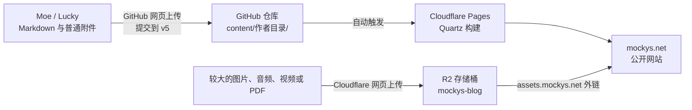

# Mockys' Nest

[](https://mockys.net) [](https://github.com/LuckytoeUSTC/Mockys_Blog/commits/v5/) [](https://github.com/LuckytoeUSTC/Mockys_Blog/commits/v5/)

Moe 与 Lucky 一起种植的 Digital Garden。网站在 [mockys.net](https://mockys.net)，文章和配置都保存在这个仓库中。了解网站运行方式请见[[#网站如何运行]]，本项目的结构请见[[#项目结构]]。

## Quick Start：发一篇文章

### 1. 准备文件

用 Typora、Obsidian 或其他编辑器写好 `.md` 文件。建议使用简短的英文文件名，单词之间用 `-` 连接，例如 `notes-on-light.md`。

文章开头加入以下属性：

```yaml
---
title: 文章标题
author: Moe
language: zh-CN
description: 一句话说明这篇文章写了什么
date: 2026-08-09
tags:
  - 标签一
  - 标签二
---
```

- `author` 填 `Moe` 或 `Lucky`；共同写作时写成 `[Moe, Lucky]`。
- `language` 中文文章填 `zh-CN`，英文文章填 `en`。
- `tags` 不能包含空格，如果用英文则单词之间用 `-` 连接。这个属性用于文章的主题分类。
- `description` 和 `tags` 可以暂时不写，其余四项建议保留。

### 2. 上传到 GitHub

1. 进入自己的目录：[`content/Moe/`](https://github.com/LuckytoeUSTC/Mockys_Blog/tree/v5/content/Moe)、[`content/Lucky/`](https://github.com/LuckytoeUSTC/Mockys_Blog/tree/v5/content/Lucky)，或暂存目录 [`content/Undetermined/`](https://github.com/LuckytoeUSTC/Mockys_Blog/tree/v5/content/Undetermined)。
2. 确认分支是 `v5`，点击 **Add file → Upload files**。
3. 直接上传 `.md`；若有普通图片或附件，把整理好的文件一起上传。
4. 在 **Commit changes** 中写一句说明，例如 `post: add notes on light`，然后提交到 `v5`。
5. 通过这个标签 [](https://github.com/LuckytoeUSTC/Mockys_Blog/commits/v5/)查看Cloudflare Pages 构建状态，`pending`表示正在构建；`passing`表示构建成功，可以到 [mockys.net](https://mockys.net) 查看文章。若为`failing`或其它，请看后面的[[#报错说明]]。

日常投稿只改自己的作者目录，不移动他人的文章。遇到上传失败、单个文件超过 **25 MiB（约 25 MB）**，或构建报错时，请看下面详细说明。

## 图片、附件与 R2

### 单个文件不超过 25 MiB（约 25 MB）：跟文章一起上传

单个文件不超过 **25 MiB（约 25 MB）** 时，可以跟文章一起上传。图片放入作者目录下的 `assets/文章文件名/`，避免不同文章出现同名文件：

```text
content/
└── Moe/
    ├── notes-on-light.md
    └── assets/
        └── notes-on-light/
            └── prism.jpg
```

文章中使用相对路径：

```md

```

### 单个文件超过 25 MiB（约 25 MB）：上传 R2

**通过 GitHub 与 Pages 发布的单个文件不得超过 25 MiB（约 25 MB）。** 超过时先尝试压缩；压缩后仍超过 25 MiB，就不要上传到仓库，改用 R2：

1. 打开 [Cloudflare Dashboard](https://dash.cloudflare.com/)，进入 **R2 object storage**。
2. 选择存储桶 **`mockys-blog`**，点击 **Upload**。
3. 建议按 `作者/文章文件名/附件名` 组织，例如 `Moe/notes-on-light/demo.mp4`；文件名尽量使用英文、数字和 `-`。
4. 上传完成后，公开链接就是资源域名加对象路径：`https://assets.mockys.net/Moe/notes-on-light/demo.mp4`。
5. 先在浏览器中打开链接确认可访问，再放入文章。

```md
[下载附件](https://assets.mockys.net/Moe/notes-on-light/demo.pdf)


```

## 报错说明

### 1. 先确认是哪次提交出错

打开 [`v5` 提交记录](https://github.com/LuckytoeUSTC/Mockys_Blog/commits/v5/)，找到自己刚提交的 commit。若 Pages 仍是 `pending`，先刷新并稍等；若是 `failing`，继续看 Cloudflare 日志。不要把其他人提交的失败误认成自己的。

### 2. 看真正的构建日志

进入 [Cloudflare Dashboard](https://dash.cloudflare.com/)：

1. 打开 **Workers & Pages**。
2. 选择 Pages 项目 **`mockys-blog`**。
3. 进入 **Deployments**，找到失败的部署。
4. 点击 **View details → Build log**。

### 3. 让大模型帮忙，但只做最小修复

把下面这些信息一起交给大模型：

- 改过的文件；
- Build log 中第一条 error 及其上下文（或者全文）；
- 预期结果，例如“新增一篇 Markdown 文章”；
- 约束：“先解释原因，再给最小修改；不要升级依赖，不要重构整个项目。”

不要粘贴 Cloudflare 密钥、API Token、账号信息或其他秘密信息。

如果只是 Frontmatter、Markdown 路径或拼写问题，可以自己更改并提交。看不懂再呼叫 Lucky。

## 写作与协作约定

- 大模型可以校对、查错和帮忙梳理，但不能替作者抹平语气。最终文字要像 Moe 或 Lucky。
- 标签用于连接文章的主题，标签体系尚未定稿，可以自由增添。
- 修改前先确认远端是否有新提交；尽量只动自己的目录。两个人同时改同一个文件时，先沟通再提交。

## 网站如何运行

这里没有内容管理后台。GitHub 保存文章与配置；Cloudflare Pages 监听 `v5` 分支，每次出现新提交便运行 Quartz，把 Markdown 编译成网页并发布。



三个徽章分别回答三个问题：`site` 检查网站此刻能否访问；`Pages` 显示 GitHub 收到的 Cloudflare Check Run；`last commit` 显示远端 `v5` 最近一次提交时间。徽章需要刷新页面才会更新，而且只能概括结果；具体错误始终以 Cloudflare 的 Build log 为准。

## 项目结构

```text
content/                         博文与普通附件
├── Lucky/                       Lucky 的内容
├── Moe/                         Moe 的内容；.gitkeep 用于保留空目录
├── Undetermined/                共同写作或尚未归档的内容
└── index.md                     网站首页
quartz/                          Quartz 程序代码
quartz.config.yaml               Mockys' Nest 的站点配置
quartz.config.default.yaml       Quartz 上游默认配置，不存放本站定制
quartz/styles/custom.scss        全站色彩与排版定制
siteMetadata.tsx                 百度站点验证等站点级 metadata
site-plugins/reader-preferences/ Aa 阅读样式控件
README.md                        Quick Start、架构与协作说明
```

本站定制集中在以上文件中，除必要的 `custom.scss` 外，不直接修改 Quartz 框架源码。当前提供浅色/深色主题、专注阅读模式，以及字体和字号设置。独立的 Quick Start 与完整 Documentation、多语言切换和标签体系仍是后续工程。

<details>
<summary>维护者入口</summary>
<ul>
<li><a href="https://dash.cloudflare.com/">Cloudflare Dashboard</a></li>
<li><a href="https://search.google.com/search-console">Google Search Console</a></li>
<li><a href="https://ziyuan.baidu.com/dashboard/index?site=https://www.mockys.net/">百度搜索资源平台</a></li>
<li><a href="https://quartz.jzhao.xyz/">Quartz 文档</a></li>
</ul>
</details>
