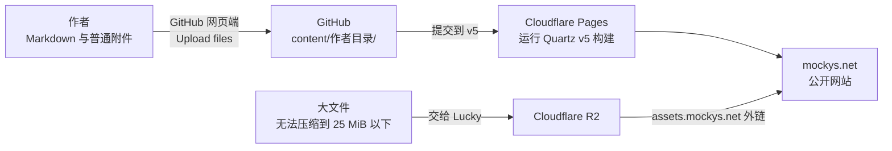

# Mockys' Nest

[](https://mockys.net) [](https://github.com/LuckytoeUSTC/Mockys_Blog/commits/v5/) [](https://github.com/LuckytoeUSTC/Mockys_Blog/commits/v5/)

Moe 与 Lucky 共同维护的数字花园，记录数学、物理、人文、摄影、播客与仍在生长的问题。访问网站：[mockys.net](https://mockys.net)。

## 网站如何运行

这是一个没有内容管理后台的静态网站。GitHub 仓库保存文章与配置，是网站内容的唯一来源；Cloudflare Pages 监听发布分支，每次收到新提交后运行 Quartz，把 Markdown 编译成网页并自动上线。



- **内容**：博文和普通附件位于 `content/`，按作者归档。
- **发布**：`v5` 是当前默认及生产分支；直接提交后，Cloudflare Pages 自动构建和部署。
- **普通附件**：与文章一起提交到作者目录下的 `assets/`，由 GitHub 跟踪并随 Pages 发布。
- **大文件**：先压缩；仍然过大时交给 Lucky 上传 R2，文章只保存 `assets.mockys.net` 外链。

顶部的两个状态徽章含义不同：`site` 只检测网站当前是否能够访问；`latest deploy` 读取最新提交的 GitHub Checks，其中的 `Cloudflare Pages` 检查由 [Cloudflare Git 集成](https://developers.cloudflare.com/pages/configuration/git-integration/github-integration/#check-runs)写回 GitHub，反映最新构建是否完成。详细构建日志仍以 Cloudflare Dashboard 为准。

## 给合作者：用 GitHub 网页上传博文

### 1. 确认文件放在哪里

- Moe 的文章放入 [`content/Moe/`](https://github.com/LuckytoeUSTC/Mockys_Blog/tree/v5/content/Moe)。
- Lucky 的文章放入 [`content/Lucky/`](https://github.com/LuckytoeUSTC/Mockys_Blog/tree/v5/content/Lucky)。
- 共同写作、暂不区分作者或尚未归档的文章放入 [`content/Undetermined/`](https://github.com/LuckytoeUSTC/Mockys_Blog/tree/v5/content/Undetermined)。

`.gitkeep` 只是用于让 Git 保留空文件夹，不需要打开或修改。日常投稿只改自己的作者目录；不要移动其他作者的文章，也不要改动 `quartz/`、`.github/` 或网站配置文件。

### 2. 准备 Markdown 文件

在本地用 Obsidian 或其他编辑器写好 `.md` 文件。建议使用简短的英文小写文件名，单词之间用连字符连接，例如 `notes-on-light.md`。

文章开头保留以下 Frontmatter；已有内容时不需要在 GitHub 网页里重新复制正文：

```md
---
title: 文章标题
description: 一句话介绍这篇文章
date: 2026-08-06
tags:
  - 标签一
  - 标签二
---
```

`title` 是网页标题，`description` 用于搜索结果和链接预览，`date` 使用 `YYYY-MM-DD` 格式。每个标签单独占一行；不需要标签时可以删掉整个 `tags` 部分。

### 3. 直接上传并发布

1. 打开上方对应的作者目录，确认左上方分支为 `v5`。
2. 点击 **Add file → Upload files**。
3. 把写好的 `.md` 文件拖入上传区域；文章有图片时，同时拖入准备好的 `assets` 文件夹。
4. 检查页面列出的目标路径，确认所有文件都位于 `content/自己的名字/`。
5. 在 **Commit changes** 中填写简短说明，例如 `post: add notes on light`。
6. 选择直接提交到 `v5`，点击 **Commit changes**。通常等待几分钟后即可在 [mockys.net](https://mockys.net) 查看结果。

需要修改已有文章时，打开对应 `.md` 文件并点击右上角铅笔图标；也可以在本地修改后重新上传同名文件。

### 4. 图片与附件

普通图片或附件放在作者目录下的 `assets/` 文件夹。例如：

```text
content/
└── Moe/
    ├── notes-on-light.md
    └── assets/
        └── prism.jpg
```

文章中使用相对路径引用：

```md

```

> [!IMPORTANT]
> **单个附件必须小于 25 MiB，并且不要卡着上限。** GitHub 网页上传和 Cloudflare Pages 的单个站点资源都以 25 MiB 为上限。图片、音频或视频请先压缩；如果无法压到限制以内，请把原文件交给 Lucky，由 Lucky 上传到 R2，再把 `https://assets.mockys.net/...` 链接发给你。不要自行配置 R2，也不要把访问密钥写进仓库。

大文件外链的写法：

```md
[下载附件](https://assets.mockys.net/路径/文件名.pdf)


```

## 项目结构

```text
content/                         博文与普通附件
├── Lucky/                       Lucky 的内容
├── Moe/                         Moe 的内容；.gitkeep 用于保留空目录
├── Undetermined/                共同写作或尚未归档的内容
└── index.md                     网站首页
quartz/                          Quartz 程序代码
quartz.config.default.yaml       网站配置
README.md                        架构、投稿说明与状态入口
```

## 文件大小依据

- [GitHub：通过浏览器添加文件，每个文件上限为 25 MiB](https://docs.github.com/en/repositories/working-with-files/managing-files/adding-a-file-to-a-repository)
- [Cloudflare Pages：单个站点资源上限为 25 MiB，较大文件建议使用 R2](https://developers.cloudflare.com/pages/platform/limits/#file-size)

<details>
<summary>维护者入口</summary>

- [Cloudflare Dashboard](https://dash.cloudflare.com/)
- [Google Search Console](https://search.google.com/search-console)
- [百度搜索资源平台](https://ziyuan.baidu.com/dashboard/index?site=https://www.mockys.net/)
- [Quartz 文档](https://quartz.jzhao.xyz/)

</details>
