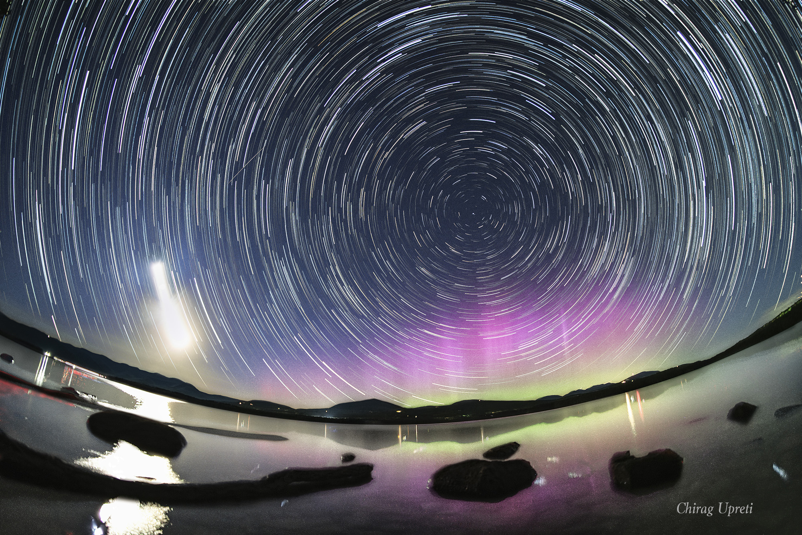

This is a test blog featuring equations, images, and audio.

>[!Note] Test Content
> - [x] Site-wide typography
> - [x] Mathematical equations
> - [x] Xiaoyuzhou podcast embedding
> - [x] Image-and-text display
> - [x] Switching between Chinese and English

## I. Scientific Derivation: Phase Space and the Energy Expression

In classical mechanics and statistical physics, phase space is used to fully describe the state of a system. For a single-particle system, its Hamiltonian can be written as:

$$
H(q, p) = \frac{p^2}{2m} + V(q)
$$

When considering the continuous evolution of the system and the distribution function $f(q, p, t)$, Liouville's theorem states that phase-space volume is conserved:

$$
\frac{d f}{d t} = \frac{\partial f}{\partial t} + \{f, H\} = 0
$$

---

## II. Humanities and Book Review: The Heterotopia of Space

In “Of Other Spaces,” Michel Foucault describes spaces that both exist in reality and stand apart from the routines of everyday life as reflections of thought and the inner world. An independent blog is one such digital heterotopia—it does not rely on algorithmic recommendations, but simply records long-term reflection and creation.

> “Space is not a lifeless container, but an interwoven network of relationships, experiences, and time.”

---

## III. Podcast Episode Preview

Below is an embedded Xiaoyuzhou podcast episode. Click the player to listen online:

Reposted: 360—Was Beethoven a Musician Who Celebrated the French Revolution? — A Single Tree Does Not Make a Forest

  

    

      Podcast Episode
      <h4 style="margin: 0.2rem 0 0 0; font-size: 1.1em;">360—Was Beethoven a Musician Who Celebrated the French Revolution?</h4>
    

    <a href="https://www.xiaoyuzhoufm.com/episode/6a71d6afab3a91c24a0fb8c4" target="_blank" rel="noopener noreferrer" style="font-size: 0.85em; background: #ea580c; color: white; padding: 0.4rem 0.8rem; border-radius: 6px; text-decoration: none; white-space: nowrap;">Listen on Xiaoyuzhou ↗</a>
  

  <audio controls style="width: 100%; height: 40px; margin-top: 0.5rem;" src="https://assets.mockys.net/test/360-%E8%B4%9D%E5%A4%9A%E8%8A%AC%E6%98%AF%E6%AD%8C%E9%A2%82%E6%B3%95%E5%9B%BD%E5%A4%A7%E9%9D%A9%E5%91%BD%E7%9A%84%E9%9F%B3%E4%B9%90%E5%AE%B6%E5%90%97%EF%BC%9F.m4a">
    Your browser does not support HTML5 audio playback.
  </audio>

---

## IV. Visual Showcase and Photography

Below is an example image:

*Image: Where thought and space intersect*
